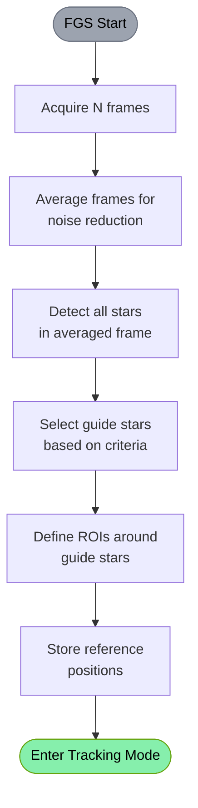
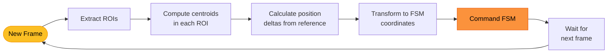
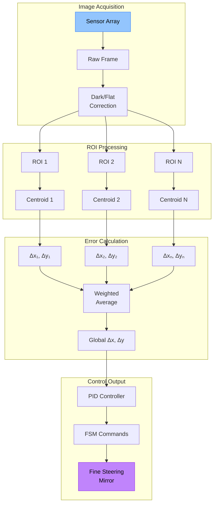
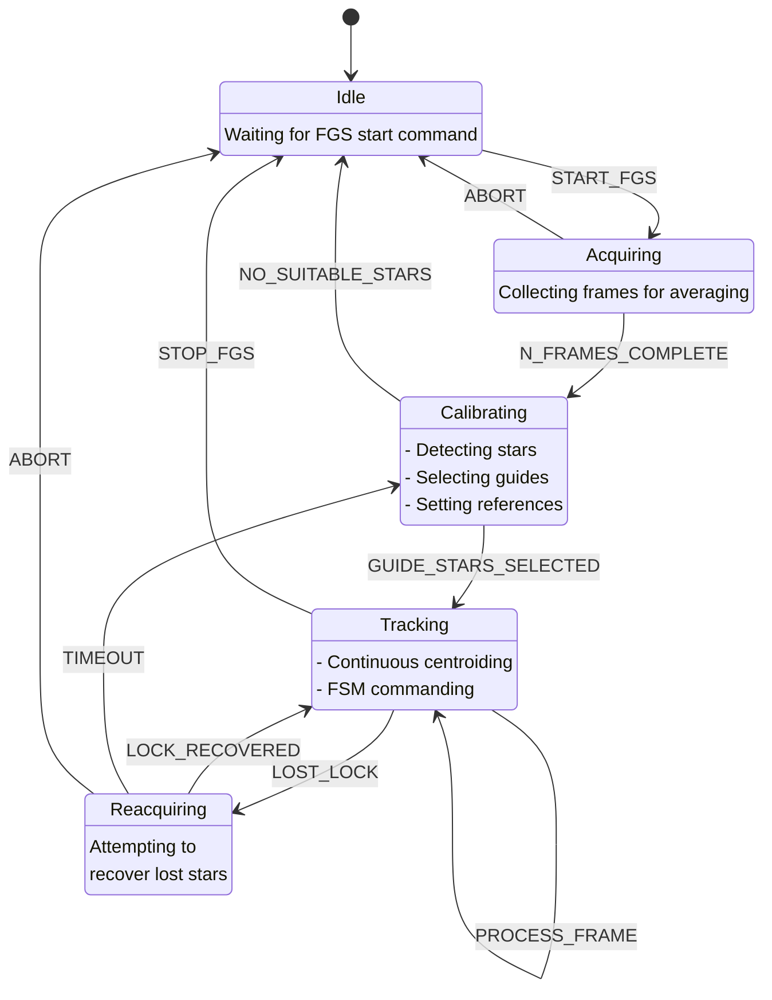
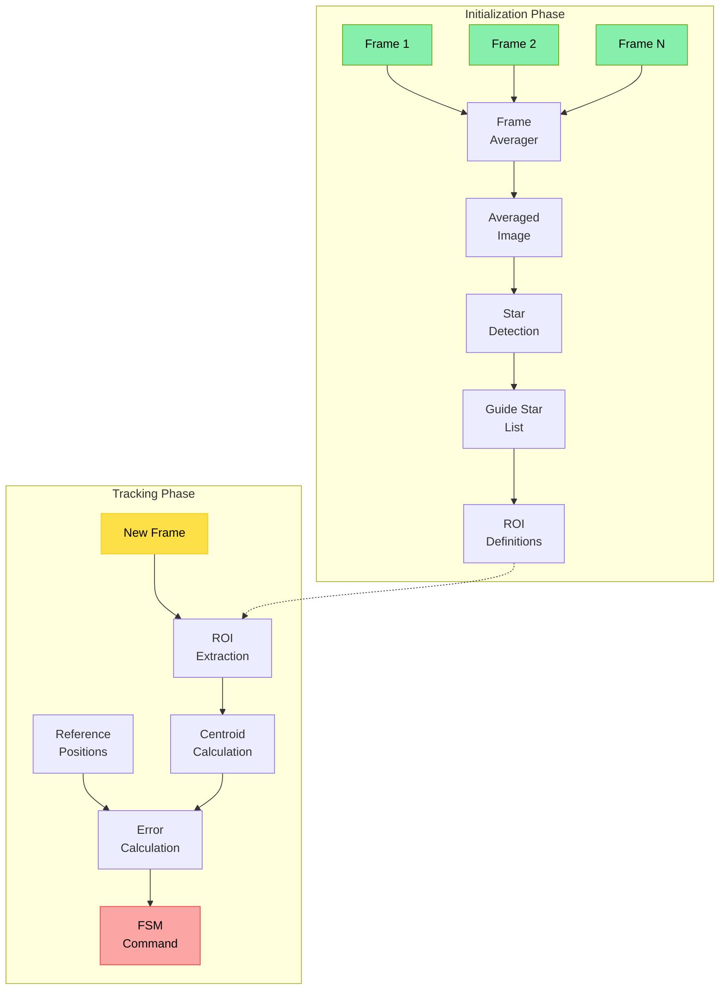
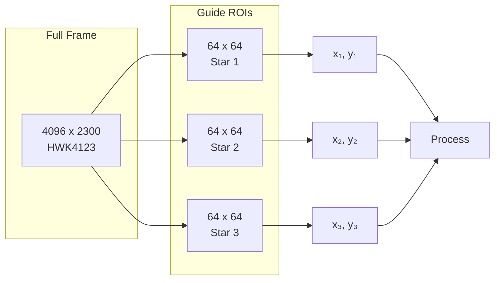

# Fine Guidance System (FGS) Concept of Operations

## Overview

The Fine Guidance System performs precision pointing control by tracking guide stars and commanding a fine steering mirror (FSM) to maintain telescope alignment.

## Operational Phases

### Phase 1: Initial Acquisition and Calibration



#### Guide Star Selection Criteria
- Brightness: Sufficient SNR but not saturated
- Position: Well distributed across field
- Shape: Round PSF (low aspect ratio)
- Isolation: No nearby contaminating sources

### Phase 2: Continuous Tracking Loop



### Phase 3: Detailed Tracking Pipeline



## State Machine



## Data Flow



## Performance Requirements

### Timing
- Frame rate: 10-100 Hz typical
- Centroid computation: < 1 ms per ROI
- Total loop latency: < 10 ms
- FSM response time: < 5 ms

### Accuracy
- Centroid precision: < 0.05 pixels
- Pointing stability: < 0.1 arcsec RMS
- Guide star minimum SNR: > 20
- Tracking range: ± 10 arcsec

## ROI Management



## Error Recovery

### Lost Guide Star Handling
1. Continue with remaining guide stars if N-1 available
2. Attempt reacquisition in expanded ROI
3. Fall back to rate gyro data if all stars lost
4. Trigger full reacquisition after timeout

### Performance Degradation
- 3+ guide stars: Nominal performance
- 2 guide stars: Reduced accuracy, no rotation control
- 1 guide star: Position hold only
- 0 guide stars: Open loop with gyro data

## Implementation Considerations

### Guide Star Selection Algorithm
```
1. Detect all stars in averaged frame
2. Filter by brightness (mag_min < m < mag_max)
3. Filter by shape (aspect_ratio < 1.5)
4. Sort by brightness
5. Select up to N_max stars with good spatial distribution
6. Define ROI as 3σ × PSF_FWHM around each star
```

### Centroid Algorithm Options
- Intensity-weighted center of mass (current implementation)
- Gaussian PSF fitting
- Quadratic interpolation
- Correlation with reference PSF

### FSM Command Generation
```
Δx_fsm = K_p × Δx_avg + K_i × ∫Δx dt + K_d × dΔx/dt
Δy_fsm = K_p × Δy_avg + K_i × ∫Δy dt + K_d × dΔy/dt
```

Where Δx_avg, Δy_avg are weighted averages across all guide stars.